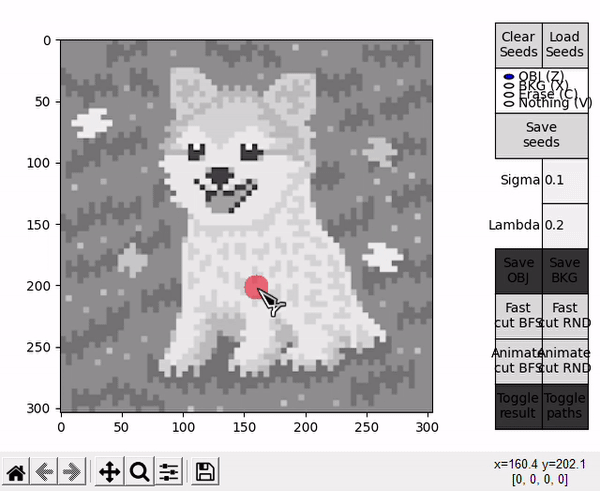
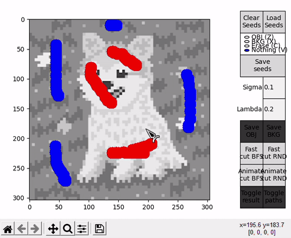

# Interactive Graph Cut Image Segmentation
This is a project for the course *Signal, Image and Video* from the University of Trento, academic year 2022-2023. It consists of an implementation for an image segmentation algorithm using an interactive method. This program is to be used through the interface provided by `src/GUI_main.py`. Refer to the [report](https://diegobarqueromorera.github.io/interactive-graph-cut-segmentation/index.html) for an explanation of the [algorithm](https://diegobarqueromorera.github.io/interactive-graph-cut-segmentation/index.html#algorithm), as well on how to use the [program](https://diegobarqueromorera.github.io/interactive-graph-cut-segmentation/index.html#implementation), among other things.

## Requirements
This implementation is written for Python 3.8 and above. It aims to be highly portable, so it has few basic dependencies:
- [NumPy](https://numpy.org/) for representing images as matrices and optimizing some steps.
- [Matplotlib](https://matplotlib.org/) (>= 3.5.0) for building the interactive GUI.
- [Pillow](https://pillow.readthedocs.io/en/stable/) for easily handling I/O image operations.
- [psutil](https://pypi.org/project/psutil/) for benchmarking the amount of memory required by the program.

## Example of usage
### Basic usage of the GUI

### Performing a fast cut with the GUI

### Performing an animated cut with the GUI

